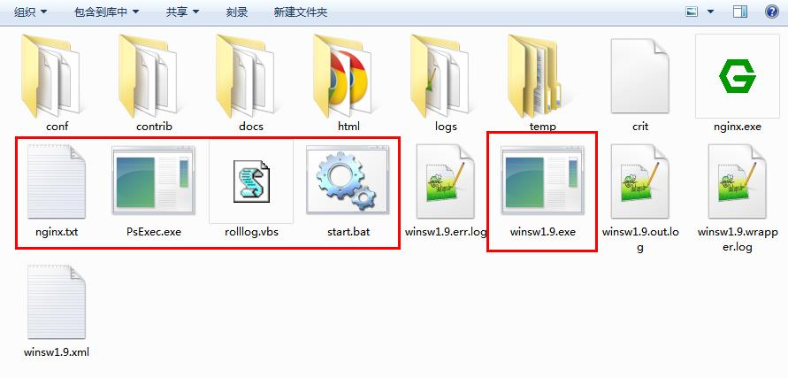
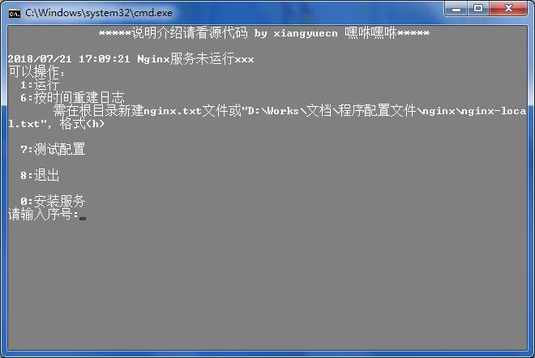
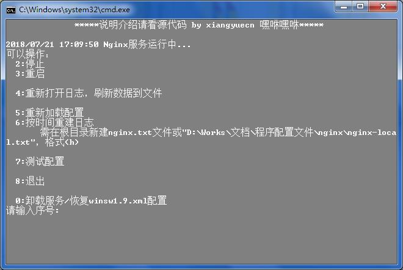
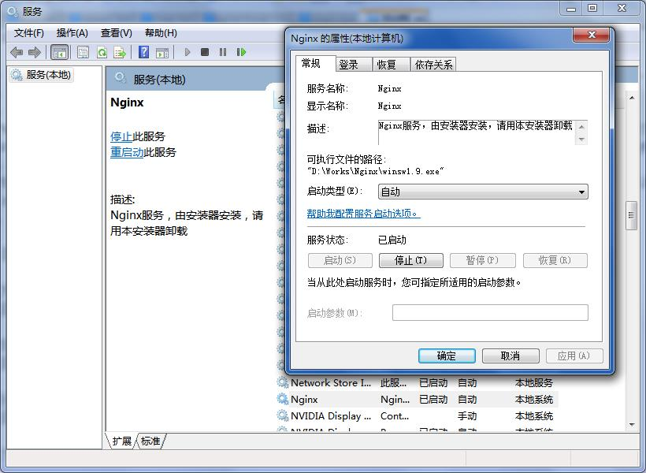
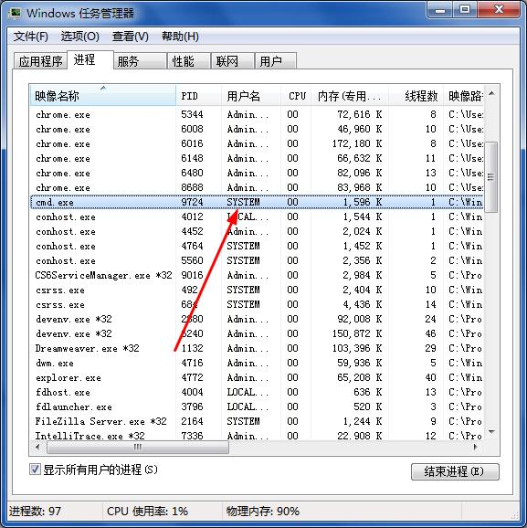
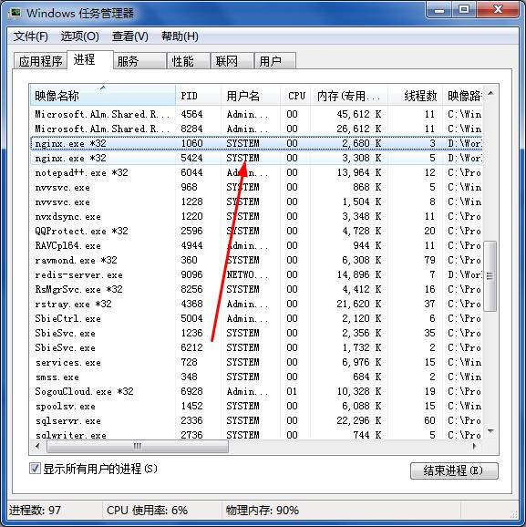

# 本工具用于Nginx Windows版的服务安装和管理

xiangyuecn编写，学习nginx之用，还没弄懂怎么配置nginx，先把安装问题先解决了，不然服务器一注销nginx也自动关掉了，首次使用于2014-02-20。

### 使用方法

1. 把bin目录内的5个文件复制到nginx根目录下（和nginx.exe同一目录，参考图1），nginx.txt为可选的配置模板文件。

2. 运行start.bat进行安装/卸载Windows服务、管理服务运行/停止/重启、更新配置、重新加载配置。


# 关于bin目录5个文件说明

#### start.bat
主脚本，对nginx服务管理每次都运行这个脚本即可完成轻松管理；如果需要调整服务名称和配置文件名称，更改此文件即可，下面有专门介绍。

#### rolllog.vbs
配置模板文件格式处理、日期替换更新脚本

#### winsw1.9.exe
windows服务安装器，用于把nginx安装为系统服务，下载地址：http://central.maven.org/maven2/com/sun/winsw/winsw/1.9/，配置介绍：https://github.com/kohsuke/winsw/blob/master/doc/xmlConfigFile.md。

#### PsExec.exe
用system用户身份运行start.bat；双击打开start.bat时的身份默认时Admin，此时并不能管理system身份的nginx；start.bat会通过PsExec.exe跳转一次执行，用户身份就变成了system。

#### nginx.txt
配置模板文件，支持任意格式重复内容只需定义一次，任何地方引用替换，大大简化重复配置的编写；此文件不提供不影响使用。


# 关于start.bat

文件内`配置部分`可以调整：
1. 对于nginx.txt模板文件并非一定要放到根目录，可以放到其他地方，通过修改nginxTxt定义，指向配置模板文件。
2. 配置文件名称通过confPath指定，默认为conf/nginx.conf，如果需要改成别的文件名，修改即可。
3. 服务名称通过svs修改，默认为Nginx；*服务安装后默认为本地系统账户，如需更改请到服务管理里面更改账户*。

服务安装运行后，winsw会产生3个log文件（参考图1），可以删除，winsw1.9.xml文件不可删除，否则无法卸载和启动。


# 关于nginx.txt

此文件内容可以和nginx配置文件内容完全一致，也可以使用扩充语法，省去那些不适合手动编辑的场景。

#### {y}、{m}、{d}、{h}、{M}、{s}
当前时间日期变量
比如log路径可以动态生成：
```
logs/access_{y}{m}{d}.log //logs/access_20101229.log
```

#### 内容支持宏定义和替换
定义：`DEF(标识) 宏名称=宏内容 (标识)END`，宏名称支持&、<、>、/、_、-、空格、换行、字母、数字、文字组合，宏内容可以多行。
使用：在需要替换的地方写上宏名称即可。
```
DEF <StaticExp>=\.(?:png|js|css|ttf|woff|eot|svg|xml|html|jpg|gif|swf)$ END

location ~*^/static/.*<StaticExp> {}
location ~*<StaticExp> {}
```
```
DEF <Crt>=ssl_certificate xx.crt;
        ssl_certificate_key xx.key; END
		
...
listen 80;
listen 443 ssl;
<Crt>
...
```


# 图例

文件组成：



安装服务：



服务管理：



已安装服务：



system进程：



nginx进程：

